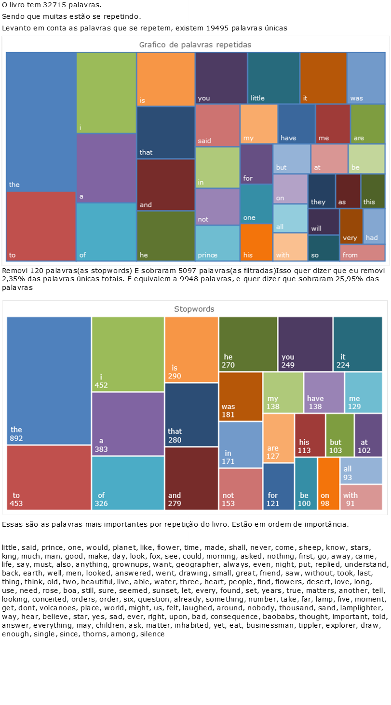

# Avaliador_de_livros

Este projeto tem como objetivo analisar a frequência de palavras em um livro fornecido em formato PDF, ajudando na avaliação da complexidade do vocabulário e na identificação de palavras-chave. Ele utiliza técnicas de processamento de linguagem natural (PLN) para extrair, limpar e analisar o texto.

## Funcionalidades

1.  **Leitura de PDF:** Lê um arquivo PDF, removendo cabeçalhos e rodapés para focar no conteúdo principal.
2.  **Limpeza do Texto:** Remove pontuações, caracteres especiais e converte o texto para minúsculas.
3.  **Tokenização:** Divide o texto em palavras individuais (tokens).
4.  **Contagem de Frequência:** Calcula a frequência de cada palavra no texto.
5.  **Remoção de Stopwords:** Remove palavras comuns do idioma inglês (como "the", "and", "a") para focar em palavras mais significativas.
6.  **Análise de Pareto:** Aplica o princípio de Pareto (regra 80/20) para identificar as palavras mais importantes para a compreensão do texto.
7. **Visualização:** Gera um gráfico de barras horizontais mostrando as palavras mais frequentes e seus tokens.
8. **Exportação para Excel:** Salva a lista de palavras ordenadas por frequência em um arquivo Excel.

## Estrutura do Repositório
Avaliador_de_livros/
├── Programa/
│ ├── app.py # Script principal com as funções de processamento.
│ ├── analize.ipynb # Notebook Jupyter para análise e visualização dos dados.
│ ├── teste.py # Script de teste para a função de remoção de stopwords.
│ └── README.md # Este arquivo README.
└── palavras.xlsx # Arquivo excel com as palavras tokenizadas.

## Dependências

-   [pdfplumber](https://github.com/jsvine/pdfplumber): Para extrair texto de arquivos PDF.
-   [pandas](https://pandas.pydata.org/): Para manipulação e análise de dados (DataFrames).
-   [nltk](https://www.nltk.org/): Para processamento de linguagem natural (remoção de stopwords).  *Você precisará baixar a lista de stopwords do NLTK executando `nltk.download('stopwords')`.*
-   [matplotlib](https://matplotlib.org/): Para visualização de dados (gráficos).
-   [openpyxl](https://openpyxl.readthedocs.io/en/stable/): O pandas usa para escrever em excel

## Como Usar

1.  **Instale as dependências:**

    ```bash
    pip install pdfplumber pandas nltk matplotlib openpyxl
    ```
    
2.  **Prepare o arquivo PDF:**
    
    -   Coloque o arquivo PDF que você deseja analisar na pasta `Programa`.

3.  **Execute o script principal (`app.py`):**

    -   Modifique a variável `caminho_pdf` no script `app.py` para apontar para o seu arquivo PDF.

        ```python
        caminho_pdf = r'C:\\Users\\jonat\\Documents\\GitHub\\Avaliador_de_livros\\Programa\\TheLittlePrince.pdf'
        ```

   -   Execute o script `app.py`. Ele irá:
        -   Ler o PDF.
        -   Limpar o texto.
        -   Calcular a frequência das palavras.
        -   Ordenar as palavras por frequência.
        -   Salvar os resultados em um arquivo chamado `palavras.xlsx` na pasta raiz do projeto.

4.  **Analise os resultados (opcional):**

    -   Abra o notebook `analize.ipynb` com o Jupyter Notebook ou JupyterLab.
    -   Execute as células do notebook para:
        -   Visualizar as palavras mais frequentes.
        -   Analisar a distribuição das palavras (aplicando o princípio de Pareto).
        -   Remover stopwords e recalcular as frequências.
        -   Obter _insights_ sobre o vocabulário do livro.
## Parte em Excel

## Detalhes das Funções (`app.py`)

-   `pontuacao()`: Retorna uma string com todos os caracteres de pontuação.
-   `ler_pdf_sem_cabecalho_rodape(caminho_arquivo, margem_superior, margem_inferior)`: Lê o PDF, removendo cabeçalho e rodapé com base nas margens especificadas.
-   `remover_pontuacao(text)`: Remove pontuações de um texto e retorna uma lista de palavras.
-   `listlist_to_list(lista)`: Converte uma lista de listas de strings em uma única lista de strings.
-  `contem_numero(s)`: Verifica se na string existe algum numero.
-   `frequencia_palavras(text_processado)`: Calcula a frequência de cada palavra em uma lista de palavras.
-   `sorted(dicionario)`: Ordena um dicionário (palavras e suas frequências) em um DataFrame do pandas e o retorna.
-   `palavras_tokenizadas(caminho_pdf)`: Função principal que orquestra todo o processo de leitura, limpeza, tokenização e contagem de frequência das palavras do PDF.  Retorna um DataFrame ordenado.
-  `remove_stopwords_df(df, coluna_palavras)`: Função do arquivo `teste.py` que usa o modulo `nltk` para retirar as _stop words_.

## Exemplo de Uso

```python
from app import palavras_tokenizadas
import pandas as pd

caminho_pdf = r'C:\\Users\\jonat\\Documents\\GitHub\\Avaliador_de_livros\\Programa\\TheLittlePrince.pdf'

df = pd.DataFrame(palavras_tokenizadas(caminho_pdf))
print(df.head(10))  # Exibe as 10 palavras mais frequentes